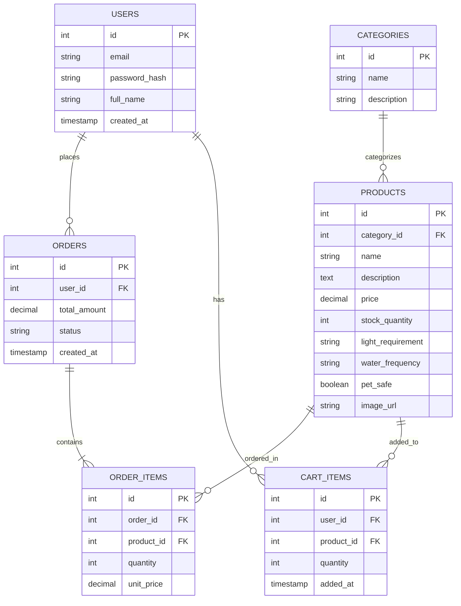

# Sprint 1: System Architecture & Scope Definition

### Project: BloomingDale — Online Plant Shop

### Course: E-Commerce | Sprint 1 Submission

---

## Section 1: Target Audience & Market Focus

**Primary Persona:**
Urban millennials and Gen Z renters/homeowners (ages 20–35) who want to decorate their living spaces with indoor and outdoor plants but have limited gardening knowledge.

**Core Pain Point:**
Customers frequently purchase plants impulsively without understanding care requirements (light exposure, watering frequency, pet toxicity), resulting in plant death, wasted money, and no simple way to reorder the same plant or find a suitable replacement.

**Domain Scope:**
Home & Garden — Live Plants and Gardening Accessories (indoor plants, succulents, outdoor plants, planters/pots).

---

## Section 2: MVP Feature Scope Matrix

| Category       | Feature Name                       | Description                                                                                       | Priority   |
| -------------- | ---------------------------------- | ------------------------------------------------------------------------------------------------- | ---------- |
| Authentication | User Registration & Authentication | Password hashing and JWT-based authentication mechanism.                                          | High (MVP) |
| Catalog        | Plant Catalog & Search             | Browse plants by category (indoor/outdoor/succulent), filter by light requirement and pet-safety. | High (MVP) |
| Cart           | Cart Management                    | State-persistent cart management (item addition, modification, and deletion).                     | High (MVP) |
| Checkout       | Order Processing                   | Mock or Stripe payment gateway integration and order object instantiation.                        | High (MVP) |
| Admin          | Inventory Control                  | Administrative CRUD operations for product inventory and stock levels.                            | Medium     |
| Catalog        | Care Guide Attributes              | Display watering frequency, sunlight needs, and pet-safety per product.                           | Low        |

---

## Section 3: Tech Stack Selection & Justification

**Frontend Framework: React (with Vite)**
Justification: React's component model suits an image-heavy plant catalog with reusable product cards, filters, and cart widgets. Its large ecosystem and academic familiarity reduce onboarding time compared to Next.js for a semester-scoped project.

**Backend Infrastructure: Node.js / Express**
Justification: Express offers a lightweight, unopinionated REST API layer that pairs naturally with a JavaScript frontend, minimizing context-switching for the team. It scales adequately for the MVP's request volume and has strong middleware support for JWT authentication.

**Database Management System: PostgreSQL**
Justification: The domain model (Users → Orders → Order_Items → Products → Categories) is inherently relational with strict foreign-key integrity needs (e.g., an Order_Item cannot exist without a valid Order and Product). PostgreSQL enforces this integrity natively, unlike a schema-less NoSQL store.

**Caching & Asynchronous Processing (Optional): Redis**
Justification: Redis can cache session/cart state for guest users before authentication, reducing database load on repeated cart reads during a browsing session.

---

## Section 4: Entity-Relationship Diagram (ERD)

### Entities, Keys & Cardinality

- **Users (1) — (N) Orders**: One user can place many orders.
- **Orders (1) — (N) Order_Items**: One order contains many order items.
- **Products (1) — (N) Order_Items**: One product can appear in many order items (N:M between Orders and Products, resolved via Order_Items).
- **Categories (1) — (N) Products**: One category groups many products.
- **Users (1) — (N) Cart_Items**: One user has many items in their cart.
- **Products (1) — (N) Cart_Items**: One product can appear in many users' carts.

### Mermaid ERD

### Attribute Data Types Summary

| Entity   | Attribute         | Type          | Notes                                  |
| -------- | ----------------- | ------------- | -------------------------------------- |
| Users    | id                | INTEGER       | PK, auto-increment                     |
| Users    | email             | VARCHAR(255)  | Unique, not null                       |
| Users    | password_hash     | VARCHAR(255)  | Hashed, never plaintext                |
| Products | price             | DECIMAL(10,2) | Currency precision                     |
| Products | stock_quantity    | INTEGER       | Non-negative                           |
| Products | light_requirement | VARCHAR(50)   | e.g. "Low", "Medium", "Bright"         |
| Products | pet_safe          | BOOLEAN       | Domain-specific attribute              |
| Orders   | status            | VARCHAR(30)   | e.g. "pending", "shipped", "delivered" |
| Orders   | total_amount      | DECIMAL(10,2) | Calculated from Order_Items            |
