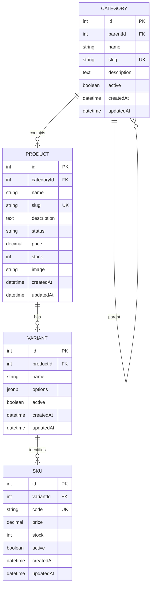

# Sprint 2 – Catalog, Variants & SKU Management

## 1. Goal and Scope

### Goal

Sprint 2 extends the BloomingDale E-Commerce backend by implementing a persistent product catalog with categories, products, variants and SKUs.

The sprint provides authenticated administrative operations for managing catalog data while enforcing database and API-level integrity rules.

### In Scope

- Category hierarchy
- Product creation and editing
- Product status management
- Product variants
- SKU creation and management
- Unique product slugs
- Unique SKU codes
- SKU-level price and stock
- Category-product relationships
- Product-variant relationships
- Variant-SKU relationships
- Authentication and admin authorization
- Database migrations and constraints
- Seed data
- Automated tests

### Out of Scope

The following features are not implemented in Sprint 2:

- Dynamic product specifications
- Asset/file upload system
- Payment
- Orders and checkout
- Shipping
- Publication workflow
- Advanced public catalog search

---

## 2. Sprint 1 Decisions Reused / Changed

Sprint 2 continues the authentication and user-role system established in Sprint 1.

The existing JWT authentication system is reused for administrative catalog operations.

Admin users are allowed to create, update and delete catalog records. Customer users can access public read operations but cannot perform administrative write operations.

The existing Express, Sequelize and PostgreSQL architecture is also reused.

Sprint 2 adds:

- Category hierarchy
- Product catalog management
- Product variants
- SKU management
- SKU-level price and inventory
- Catalog database relationships
- Seed data
- Automated Sprint 2 tests

---

## 3. ERD and Data Model

### Entity Relationship Diagram

Data Dictionary
Entity	Field	Description
Category	id	Primary key
Category	parentId	Optional parent category
Category	name	Category name
Category	slug	Unique URL-friendly identifier
Category	active	Category availability
Product	id	Primary key
Product	categoryId	Foreign key to category
Product	name	Product name
Product	slug	Unique product identifier
Product	description	Product description
Product	status	draft, active or archived
Product	price	Product-level price retained from Sprint 1
Product	stock	Product-level stock retained from Sprint 1
Variant	id	Primary key
Variant	productId	Foreign key to product
Variant	name	Variant name
Variant	options	JSONB option values
Variant	active	Variant availability
SKU	id	Primary key
SKU	variantId	Foreign key to variant
SKU	code	Unique SKU code
SKU	price	Sellable SKU price
SKU	stock	Available SKU inventory
SKU	active	SKU availability

Relationships

- One category can contain many products.
- A category can optionally have a parent category.
- One product can have zero or more variants.
- One variant belongs to exactly one product.
- One variant can have one or more SKUs.
- Each SKU belongs to exactly one variant.
- SKU code is globally unique.

4. API Routes
   The project uses /api routes rather than the optional /api/v1/admin naming from the Sprint 2 baseline.
   Categories
   Method	Endpoint	Authentication
   GET	/api/categories	Public
   GET	/api/categories/:id	Public
   POST	/api/categories	Admin
   PUT	/api/categories/:id	Admin
   DELETE	/api/categories/:id	Admin

Products
Method	Endpoint	Authentication
GET	/api/products	Public
GET	/api/products/:id	Public
POST	/api/products	Admin
PUT	/api/products/:id	Admin
DELETE	/api/products/:id	Admin

Variants
Method	Endpoint	Authentication
GET	/api/variants	Public
GET	/api/variants/product/:productId	Public
POST	/api/variants	Admin
PUT	/api/variants/:id	Admin
DELETE	/api/variants/:id	Admin

SKUs
Method	Endpoint	Authentication
GET	/api/skus	Public
GET	/api/skus/variant/:variantId	Public
POST	/api/skus	Admin
PATCH	/api/skus/:id	Admin
DELETE	/api/skus/:id	Admin

5. Validation and Integrity
   Product Validation
   Product creation validates:

- Product name is required.
- Price must be greater than zero.
- Stock cannot be negative.
- Category must exist.
- Status must be draft, active or archived.
- Product names cannot be duplicated.
- Product slugs must be unique.
  Duplicate product slugs return a clear client error.
  SKU Validation
  SKU creation validates:
- Variant must exist.
- SKU code is required.
- SKU code must be unique.
- Price must be greater than zero.
- Stock cannot be negative.
  Duplicate SKU codes return HTTP 409.
  Database Integrity
  Database-level constraints are used in addition to API validation.
  The schema includes:
- Primary keys
- Foreign keys
- Unique constraints
- SKU unique code constraint
- Non-negative SKU stock constraint
- Product/category relationships
- Product/variant relationships
- Variant/SKU relationships
  This ensures invalid records cannot be inserted only by bypassing API validation.
  Money
  Prices use PostgreSQL/Sequelize decimal numeric fields rather than floating-point values.
  Inventory
  Stock values cannot be negative.
  An unavailable SKU is represented by its actual SKU record with zero stock and/or inactive status rather than creating a fake product or combination.

6. Authentication and Authorization
   Administrative write operations require a valid JWT access token.
   The authorization flow is:
7. User logs in through the authentication API.
8. Server generates a JWT.
9. Client sends the token using the Authorization header.
10. Authentication middleware verifies the token.
11. Admin authorization middleware checks the user's role.
12. Only users with the admin role can perform catalog write operations.
    Unauthenticated requests receive HTTP 401.
    Authenticated non-admin users receive HTTP 403.
    Example:
    Authorization: Bearer <access-token></access>

Tokens and private credentials are not included in this documentation.
7. Business Rules

1. Can a draft product exist without a SKU?
   Yes. A draft product can exist before its sellable SKU configuration is completed.
   An active/sellable catalog item should have a valid SKU before being used for inventory-based purchasing.
2. Why does a product use one canonical category?
   Each product has one primary category through categoryId.
   This keeps catalog ownership simple and avoids ambiguity in the primary catalog hierarchy. Additional categorization can be considered in a future sprint if required.
3. What happens when a parent category is deactivated?
   Deactivation changes the category's active status rather than deleting the category.
   Existing products remain linked to their category so historical catalog relationships are preserved.
4. How is an out-of-stock SKU represented?
   The SKU remains present with its stock value set to zero.
   An unavailable combination is therefore represented by an actual SKU record instead of a fabricated zero-stock product.
5. Where is variant-level price stored?
   Each SKU has its own price.
   This allows different sellable variants to have different prices.
6. How are negative stock and duplicate SKU codes prevented?
   Negative stock is rejected by API validation and database constraints.
   Duplicate SKU codes are checked by the API and enforced through the database unique constraint.
7. What happens to a deactivated product referenced later?
   The catalog record is retained rather than silently removed. Future cart/order functionality can apply its own rules for whether the product or SKU can still be purchased.
8. Seed / Demo Data
   Sprint 2 includes a reproducible catalog seed:
   20261002193000-sprint-2-catalog-seed.js

Run it using:
npx sequelize-cli db:seed --seed 20261002193000-sprint-2-catalog-seed.js

The seed provides:
Categories

- Indoor Plants
- Outdoor Plants
- Plant Pots as a child category
  Products
- Snake Plant
- Peace Lily
- Rose Plant
  Variants
  Snake Plant includes multiple variants:
- Small Green
- Large Green
  Peace Lily includes:
- Standard
  Rose Plant includes:
- Red
  SKUs
  The seed contains at least four SKUs:
- SNAKE-S-GREEN
- SNAKE-L-GREEN
- PEACE-STANDARD
- ROSE-RED
  ROSE-RED is intentionally unavailable with zero stock and inactive status.
  The seed is designed to safely reuse existing matching records and avoid duplicate catalog records.

9. Automated Tests
   Sprint 2 includes automated Jest and Supertest tests.
   The tests cover:

- Admin registration
- Customer registration
- Admin login
- Customer login
- Category retrieval
- Unauthorized category creation
- Customer authorization rejection
- Admin category creation
- Product pagination
- Unauthorized product creation
- Customer authorization rejection
- Negative product price rejection
- Negative product stock rejection
- Duplicate product slug rejection
- Admin product creation
- Unauthorized variant creation
- Customer variant authorization rejection
- Admin variant creation
- Invalid product variant rejection
- Unauthorized SKU creation
- Customer SKU authorization rejection
- Invalid variant rejection
- Negative SKU stock rejection
- Admin SKU creation
- Duplicate SKU rejection
- SKU retrieval
- SKU stock update
  Run the tests with:
  npm test -- --runInBand

The Sprint 2 automated test suite contains 27 tests.
Expected result:
PASS tests/sprint2.test.js

Tests: 27 passed, 27 total

The test suite also closes the Sequelize database connection after execution.
10. Database Migrations
Sprint 2 adds database migrations for:
variants
skus

The migrations create the required foreign keys, unique SKU code constraint and non-negative stock database constraint.
Run migrations with:
npx sequelize-cli db:migrate

Check migration status with:
npx sequelize-cli db:migrate:status

11. Setup
    Install dependencies:
    npm install

Create a .env file containing the required environment variables.
Do not commit passwords, JWT secrets or other private credentials.
Create/update the PostgreSQL database and configure the development database connection.
Run migrations:
npx sequelize-cli db:migrate

Run the Sprint 2 seed:
npx sequelize-cli db:seed --seed 20261002193000-sprint-2-catalog-seed.js

Run tests:
npm test -- --runInBand

Start the server:
npm run dev

or:
npm start

depending on the configured npm scripts.
12. Sprint 3 Foundation
Sprint 2 provides the catalog foundation required by future commerce functionality.
Sprint 3 can consume:

- Product IDs
- Variant IDs
- SKU IDs
- SKU prices
- SKU stock
- Category relationships
  Future cart and order functionality should reference SKU identities instead of duplicating product, pricing and inventory logic.
  Potential Sprint 3 work includes:
- Cart
- Cart items
- Quantity validation
- Orders
- Order items
- Checkout
- Inventory reservation
- Payment integration
- Shipping

13. Limitations
    The following improvements can be considered in future iterations:

- Advanced category hierarchy validation
- Rich product specifications
- Product asset management
- Advanced catalog filtering
- Public catalog search
- Inventory reservation
- Cart and order workflows
- Payment processing
- Shipping integration
  These features are outside the Sprint 2 implementation scope.

14. Sprint 2 Completion Summary
    Sprint 2 establishes a persistent catalog model consisting of:
    Category
    ↓
    Product
    ↓
    Variant
    ↓
    SKU

The backend now supports authenticated administrative catalog management, database relationships and constraints, SKU-level pricing and inventory, reproducible seed data, and automated API tests.
The implementation is ready to serve as the catalog foundation for Sprint 3.
